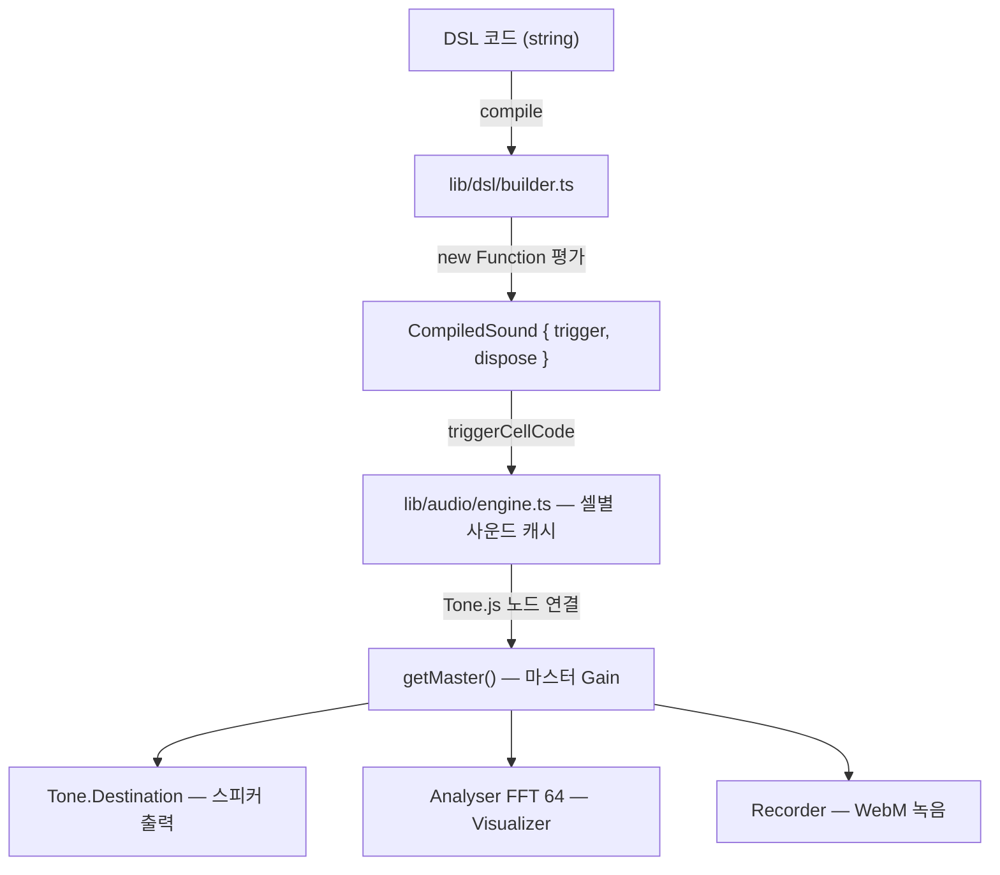
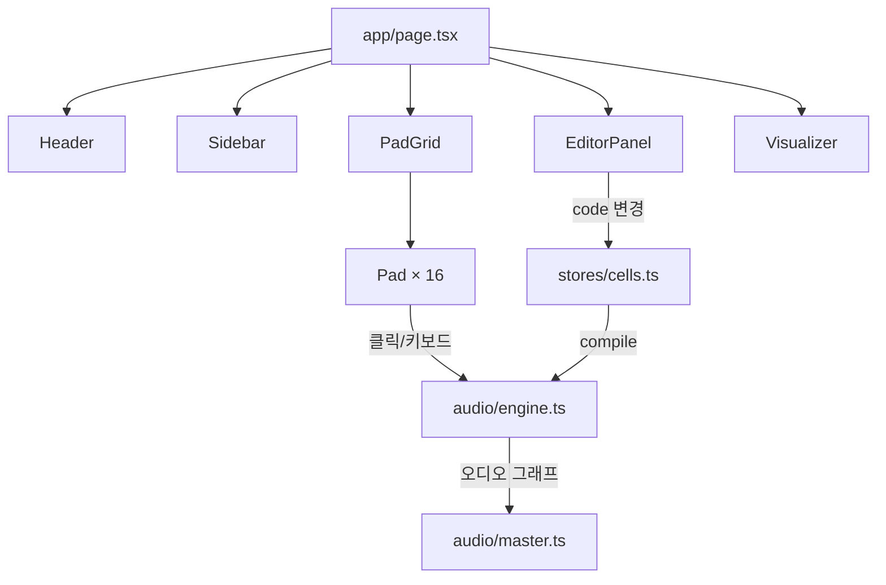
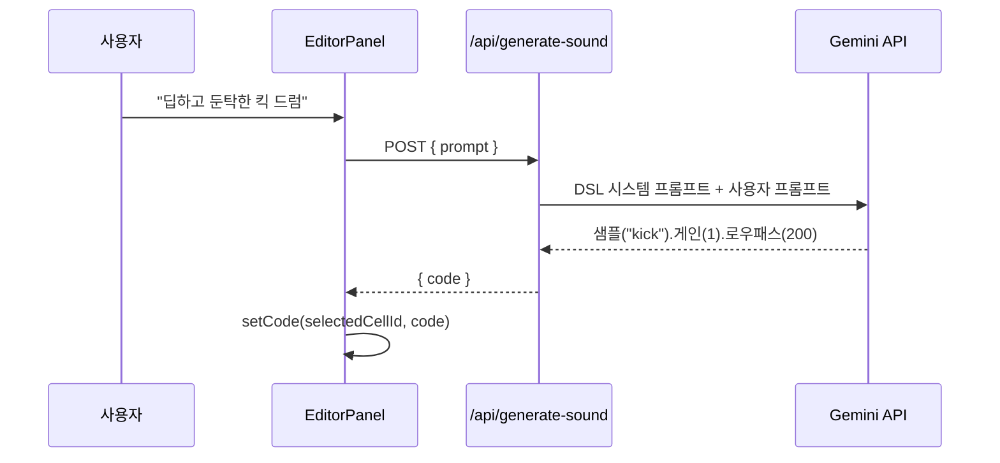

# PADCODE

> 브라우저에서 동작하는 프로그래머블 런치패드 — 코드로 사운드를 정의하고, 키보드로 실시간 연주

---

## 프로젝트 개요

PadCode는 4×4 패드 그리드에 한글/영어 DSL 코드를 입력해 사운드를 정의하고, 키보드로 실시간 트리거하는 **브라우저 기반 라이브 코딩 악기**다.

- 런치패드처럼 패드를 누르면 소리가 난다
- 각 패드에는 Tone.js 기반 사운드를 정의하는 DSL 코드가 들어간다
- 키보드 `1234 / QWER / ASDF / ZXCV` 로 16개 패드를 즉시 트리거한다
- AI(Gemini)에 자연어로 사운드를 설명하면 DSL 코드를 자동 생성한다

---

## 기술 스택

| 영역 | 기술 |
|------|------|
| 프레임워크 | Next.js 15 (App Router, 프론트엔드 SPA) |
| 오디오 | Tone.js 15 (Web Audio API 래퍼) |
| 에디터 | CodeMirror 6 (자동완성, 린터 포함) |
| 상태 관리 | Zustand 5 |
| AI | Google Gemini API (`@google/generative-ai`) |
| 스타일 | Tailwind CSS 3 (아케이드/터미널 테마) |
| 언어 | TypeScript 5 |

---

## 실행 방법

```bash
# 1. 의존성 설치
npm install

# 2. 환경변수 설정 (AI 기능 사용 시)
cp .env.example .env
# .env 에 GEMINI_API_KEY 입력

# 3. 개발 서버 실행
npm run dev
# → http://localhost:3000

# 빌드
npm run build

# 린트
npm run lint
```

> AI 기능(`GEN` 버튼)을 사용하지 않는다면 `GEMINI_API_KEY` 없이도 모든 기능이 동작한다.

---

## UI 레이아웃

```
┌──────────────────────────────────────────────────────────────┐
│  Header: PADCODE  ·  BPM display  ·  Pads used (00/16)       │
├─────────────┬──────────────────────┬─────────────────────────┤
│             │                      │                         │
│  Sidebar    │   PadGrid (4×4)      │   EditorPanel           │
│  ─────────  │                      │   ─────────────         │
│  MY SAMPLES │  [1][2][3][4]        │   DSL code editor       │
│  + UPLOAD   │  [Q][W][E][R]        │   (CodeMirror 6)        │
│             │  [A][S][D][F]        │                         │
│  SOUND BANK │  [Z][X][C][V]        │   AI SOUND GEN          │
│  presets    │                      │   prompt → DSL          │
│             │                      │                         │
├─────────────┴──────────────────────┴─────────────────────────┤
│     Visualizer: FFT spectrum + waveform (full width)         │
└──────────────────────────────────────────────────────────────┘
```

---

## 아키텍처

### 데이터 흐름



### 컴포넌트 구조



### 상태 관리 (Zustand)

| 스토어 | 역할 |
|--------|------|
| `stores/cells.ts` | 16개 CellData (DSL 코드, playMode, looping) |
| `stores/ui.ts` | selectedCellId, BPM, 퍼포먼스 모드 |
| `stores/recording.ts` | 녹음 상태, WebM blob URL |
| `stores/samples.ts` | 사용자 업로드 샘플 목록 |

---

## DSL 시스템

`lib/dsl/builder.ts`의 `SoundBuilder` 클래스를 체이닝 방식으로 사용한다.  
`compile(code)` 함수가 `new Function(...dslBindings, "return (${code}).build()")` 로 실행한다.

### 사운드 소스 (7종)

| 한글 | 영어 | 설명 |
|------|------|------|
| `사인파(freq)` | `sin(freq)` | 사인파 오실레이터 |
| `노이즈()` | `noise()` | 화이트 노이즈 |
| `샘플("name")` | `sample("name")` | 드럼 샘플 — kick snare hat clap tom cymbal |
| `플럭(freq)` | `pluck(freq)` | 기타/현악기 (PluckSynth) |
| `베이스(freq)` | `bass(freq)` | 신스 베이스 (MonoSynth, 톱니파) |
| `피아노(freq)` | `piano(freq)` | 피아노 음색 (삼각파) |
| `오르간(freq)` | `organ(freq)` | 오르간 (AMSynth) |

### 이펙트 체인 (9종)

| 한글 | 영어 | 설명 |
|------|------|------|
| `.게인(0~2)` | `.gain(v)` | 볼륨 (기본 0.6) |
| `.로우패스(hz)` | `.lowpass(hz)` | 저역 통과 필터 |
| `.밴드패스(hz)` | `.bandpass(hz)` | 대역 통과 필터 |
| `.딜레이(0~1)` | `.delay(t)` | 딜레이 (초 단위, 예: `1/8`) |
| `.피치다운(semis)` | `.pitch(n)` | 피치 낮추기 (반음 단위) |
| `.스무딩(ms)` | `.smooth(ms)` | 어택 스무딩 |
| `.에코(0~100)` | `.echo(level)` | 피드백 에코 |
| `.스텝("x..x.")` | `.step(pat)` | 스텝 패턴 (x=트리거, .=쉬기) |
| `.확률(0~1)` | `.prob(p)` | 랜덤 트리거 확률 |

### 예제

```js
// 킥 드럼
샘플("kick").게인(1)

// 딜레이 아르페지오
사인파(660).게인(0.3).딜레이(0.125).에코(20)

// 신스 베이스
베이스(80).게인(0.8).로우패스(300)

// 기타
플럭(330).게인(0.6)

// 확률적 노이즈 퍼커션
노이즈().게인(0.2).밴드패스(3000).확률(0.6)
```

---

## AI 사운드 생성

사운드를 자연어로 설명하면 Gemini API가 DSL 코드를 생성해 해당 패드에 바로 적용한다.



- **서버 사이드 실행**: `app/api/generate-sound/route.ts` (Next.js API Route)
  - API 키는 서버에서만 읽음 — 클라이언트에 노출되지 않음
- **모델 폴백**: `gemini-2.5-flash` → `gemini-2.5-flash-lite` → `gemini-2.0-flash`
  - 503/429(과부하·쿼터 초과)일 때만 다음 모델 시도
- **환경변수**: `GEMINI_API_KEY` — `.env` 또는 `.env.local`에 설정

---

## 키보드 매핑

| 행 | 키 | 패드 |
|----|----|------|
| 1 | `1 2 3 4` | r0c0 ~ r0c3 |
| 2 | `Q W E R` | r1c0 ~ r1c3 |
| 3 | `A S D F` | r2c0 ~ r2c3 |
| 4 | `Z X C V` | r3c0 ~ r3c3 |

- 물리 키코드(`e.code`) 기준 — IME 입력 방식에 독립적
- CodeMirror 에디터에 포커스 중일 때는 키보드 트리거 비활성화

---

## 패드 조작

| 동작 | 결과 |
|------|------|
| 패드 클릭 / 키보드 | 사운드 트리거 |
| 패드 우클릭 | loop 모드 토글 |
| Sidebar 프리셋 클릭 | 선택 패드에 DSL 코드 삽입 |
| Sidebar 샘플 업로드 | MP3/WAV → `샘플("이름")`으로 사용 가능 |

---

## 에디터 기능

- **DSL 자동완성**: 한글/영어 함수명 및 파라미터 힌트
- **실시간 린터**: 코드 오류 시 빨간 밑줄 + 에러 메시지
- **슬래시 명령어**:
  - `/help` — DSL 전체 레퍼런스 삽입
  - `/guide` — 시작 가이드 + 예제 삽입

---

## 프로젝트 구조

```
padcode/
├── app/
│   ├── api/generate-sound/route.ts   # Gemini API 서버 라우트
│   ├── layout.tsx
│   └── page.tsx                      # 메인 레이아웃 (CSS Grid)
├── components/
│   ├── EditorPanel.tsx               # CodeMirror 에디터 + AI 입력창
│   ├── Header.tsx                    # BPM, 패드 사용 현황
│   ├── Pad.tsx                       # 개별 패드 셀
│   ├── PadGrid.tsx                   # 4×4 그리드
│   ├── Sidebar.tsx                   # 샘플 업로드 + 프리셋
│   └── Visualizer.tsx                # FFT 스펙트럼 시각화
├── hooks/
│   └── useKeyboardTrigger.ts         # 키보드 → 패드 트리거
├── lib/
│   ├── audio/
│   │   ├── engine.ts                 # 셀별 사운드 캐시 및 트리거
│   │   ├── master.ts                 # 마스터 Gain + Analyser + Recorder
│   │   └── sampleBank.ts            # 사용자 업로드 샘플 버퍼
│   ├── dsl/
│   │   └── builder.ts               # SoundBuilder DSL + compile()
│   ├── editor/
│   │   └── dslExtensions.ts         # CodeMirror 자동완성/린터
│   └── keymap.ts                    # 키 → 셀 ID 매핑
└── stores/
    ├── cells.ts                      # 16셀 DSL 코드 상태
    ├── recording.ts                  # 녹음 상태
    ├── samples.ts                    # 업로드 샘플 목록
    └── ui.ts                         # UI 선택 상태, BPM
```

---

## 현재 구현 상태

### 구현 완료
- 4×4 패드 그리드 + 키보드 트리거
- 한글/영어 DSL — 7종 소스, 9종 이펙트
- CodeMirror 6 에디터 (자동완성, 실시간 린터)
- 프리셋 사이드바 (클릭으로 패드에 코드 삽입)
- 사용자 MP3/WAV 샘플 업로드
- FFT 비주얼라이저 (하단)
- WebM 녹음
- AI 사운드 생성 (Gemini API)
- 루프 모드 (우클릭 토글)

### 미구현 (계획)
- 셀별 미니 비주얼라이저
- 라이브/레코딩/플레이백 모드 전환 UI
- 이벤트 타임라인 기반 플레이백
- 그리드 크기 커스텀
- 라이트/다크 테마 전환
- localStorage 영속 저장
