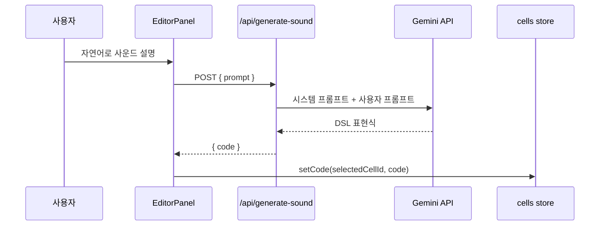

# AI 사운드 생성

PadCode는 자연어 프롬프트를 DSL 코드로 바꾸기 위해 Gemini API를 사용합니다.

## 위치

서버 라우트는 다음 파일에 있습니다.

```text
app/api/generate-sound/route.ts
```

클라이언트에서는 `components/EditorPanel.tsx`가 이 라우트로 요청을 보냅니다.

## 환경변수

```bash
GEMINI_API_KEY=...
```

API 키는 서버 라우트에서만 읽습니다. 클라이언트 컴포넌트에 직접 노출하지 않습니다.

## 요청 흐름



## 서버 라우트 동작

1. `GEMINI_API_KEY`가 없으면 500 응답을 반환합니다.
2. 요청 본문의 `prompt`가 없거나 비어 있으면 400 응답을 반환합니다.
3. 시스템 프롬프트로 PadCode DSL 규칙을 전달합니다.
4. Gemini 응답에서 코드블록 마커를 제거합니다.
5. `{ code }` JSON을 반환합니다.

## 모델 폴백

모델은 다음 순서로 시도합니다.

1. `gemini-2.5-flash`
2. `gemini-2.5-flash-lite`
3. `gemini-2.0-flash`

503 또는 429 계열 오류로 판단될 때만 다음 모델을 시도합니다. 그 외 오류는 즉시 중단하고 마지막 오류를 반환합니다.

## 생성 규칙

시스템 프롬프트는 모델에 다음 규칙을 강제합니다.

- 한 줄짜리 DSL 표현식만 반환
- Markdown, 설명, 코드블록, 주석 금지
- 사운드 소스는 하나만 선택
- 이펙트는 점 표기법으로 체이닝
- PadCode가 지원하는 함수와 값 범위 안에서 생성

예시 출력:

```js
샘플("kick").게인(1).로우패스(200)
```

## 현재 제약

- 서버 라우트는 생성된 DSL을 반환하기 전에 `compile()`로 검증하지 않습니다.
- 검증은 클라이언트 에디터 린터와 실제 재생 시점에 이루어집니다.
- Gemini API 장애나 쿼터 제한이 있으면 AI 생성 기능만 실패합니다. 다른 패드 기능은 계속 사용할 수 있습니다.
