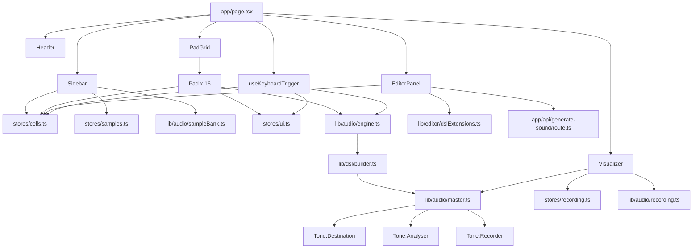
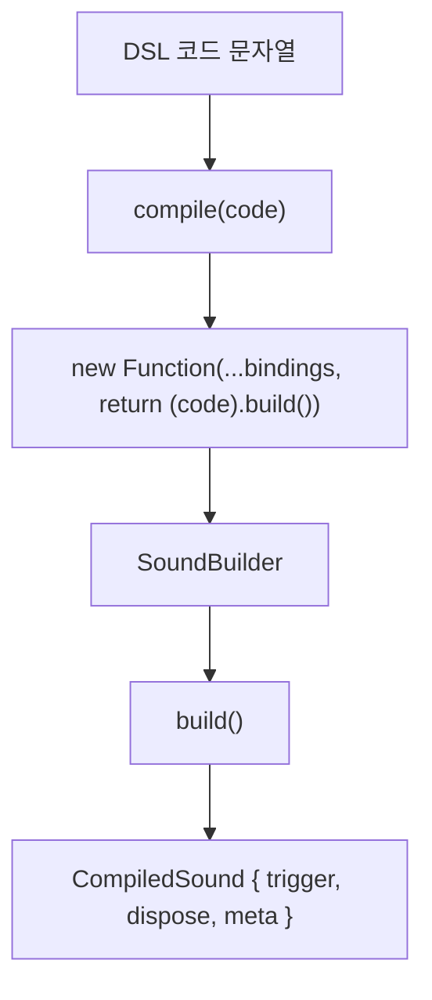
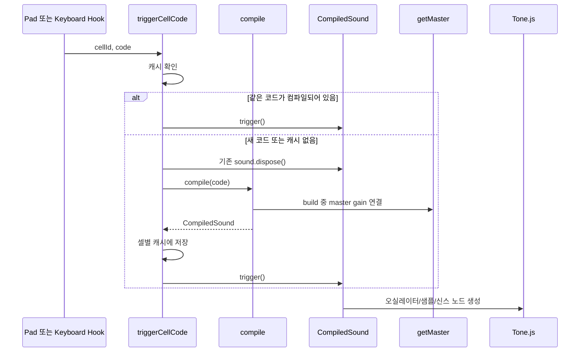
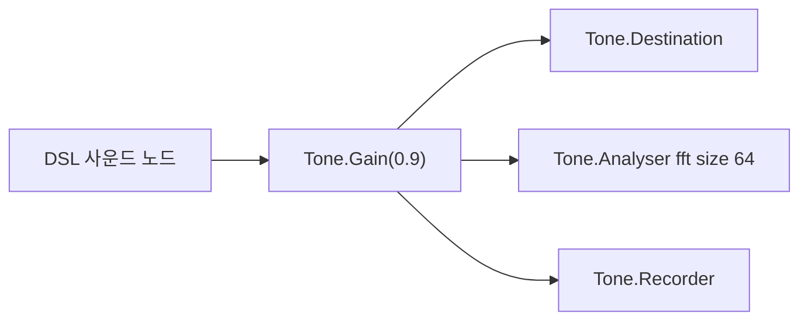
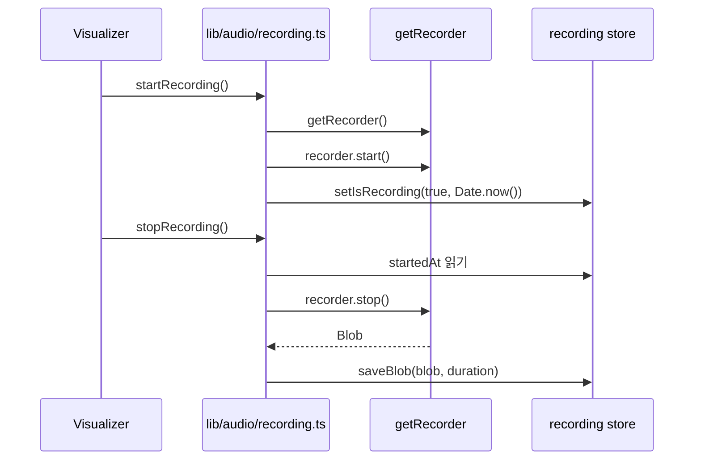
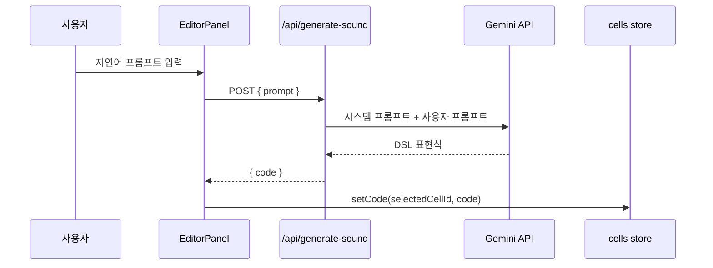

# 아키텍처

PadCode는 브라우저에서 실행되는 프로그래머블 런치패드입니다. Next.js App Router를 사용하지만, 핵심 기능은 대부분 클라이언트 컴포넌트와 브라우저 Web Audio 환경에서 동작합니다. 서버 기능은 현재 Gemini API를 호출하는 사운드 생성 라우트에 한정됩니다.

## 전체 구조



## 기술 스택

| 영역 | 기술 |
| --- | --- |
| 프레임워크 | Next.js 15, App Router |
| UI | React 19 |
| 오디오 | Tone.js 15, Web Audio API |
| 에디터 | CodeMirror 6, `@uiw/react-codemirror` |
| 상태 관리 | Zustand 5 |
| AI | Google Gemini API, `@google/generative-ai` |
| 스타일 | Tailwind CSS 3 |
| 언어 | TypeScript 5 |

## 런타임 성격

대부분의 앱은 브라우저 전용입니다. Tone.js는 Web Audio API를 사용하므로 오디오 관련 코드가 서버 렌더링 단계에서 실행되면 안 됩니다. 그래서 다음 파일들은 `"use client"` 경계를 갖습니다.

- `app/page.tsx`
- `components/*`
- `hooks/useKeyboardTrigger.ts`
- `lib/audio/*`

`app/api/generate-sound/route.ts`만 서버 라우트로 동작합니다. 이 라우트는 Gemini API 키를 서버 환경변수에서 읽고, 클라이언트에는 생성된 DSL 코드만 반환합니다.

## 화면 레이아웃

`app/page.tsx`는 CSS Grid로 전체 앱을 배치합니다.

```text
┌──────────────────────────────────────────────────────────────┐
│ Header                                                       │
├─────────────┬────────────────────────┬───────────────────────┤
│ Sidebar     │ PadGrid                │ EditorPanel           │
│             │ 4 x 4 Pad              │ CodeMirror + AI 입력  │
├─────────────┴────────────────────────┴───────────────────────┤
│ Visualizer + Recorder                                        │
└──────────────────────────────────────────────────────────────┘
```

그리드 정의는 `app/page.tsx` 안의 인라인 스타일에 있습니다.

- 열: `200px 1fr 380px`
- 행: `70px minmax(0, 1fr) 260px`
- 영역: `header`, `sidebar`, `pads`, `editor`, `viz`

## 컴포넌트 책임

| 컴포넌트 | 책임 |
| --- | --- |
| `Header` | 프로젝트 타이틀, BPM, 패드 사용 상태 표시 |
| `Sidebar` | 사용자 샘플 업로드, 샘플 목록, 프리셋 삽입 |
| `PadGrid` | 4×4 패드 배치 |
| `Pad` | 셀 선택, 클릭 재생, 우클릭 루프 토글, 코드 삭제, 셀 상태 표시 |
| `EditorPanel` | 선택 셀의 DSL 편집, CodeMirror 확장 적용, AI 사운드 생성 요청 |
| `Visualizer` | FFT 바 시각화, RMS 기반 애니메이션, 녹음 시작/정지/저장/삭제 UI |

## 상태 관리

상태는 Zustand 스토어 4개로 나뉩니다. 현재 별도 영속 저장은 없으므로 새로고침하면 인메모리 상태가 초기화됩니다.

### 셀 상태

`stores/cells.ts`는 16개 셀을 `Record<string, CellData>`로 관리합니다.

```ts
type CellData = {
  id: string;
  row: number;
  col: number;
  code: string;
  keyBinding: string | null;
  playMode: "oneshot" | "loop";
  looping: boolean;
};
```

셀 ID는 `r{row}c{col}` 형식입니다. 예를 들어 좌상단은 `r0c0`, 우하단은 `r3c3`입니다.

주요 액션은 다음과 같습니다.

- `setCode(id, code)`: 선택 셀에 DSL 코드 저장
- `clearCode(id)`: 코드 삭제와 루프 상태 해제
- `setPlayMode(id, mode)`: 재생 모드 변경
- `toggleLoop(id)`: 루프 플래그 토글

현재 `playMode`와 `looping`은 구분되어 있지만, UI에서는 우클릭으로 `looping` 플래그를 토글하는 흐름이 중심입니다.

### UI 상태

`stores/ui.ts`는 선택, 펄스, 퍼포먼스 모드, BPM을 관리합니다.

- `selectedCellId`: 에디터에 표시할 셀
- `pulsingCellId`: 최근 트리거되어 깜박이는 셀
- `mode`: `live`, `rec`, `play`
- `bpm`: 60~200 범위로 제한

현재 `mode` 상태는 존재하지만, 완성된 모드 전환 UI와 이벤트 타임라인 재생은 아직 구현되어 있지 않습니다.

### 녹음 상태

`stores/recording.ts`는 WebM 녹음 결과와 UI 상태를 관리합니다.

- `isRecording`: 녹음 중 여부
- `blobUrl`: 녹음된 WebM Blob의 object URL
- `duration`: 녹음 길이
- `startedAt`: 녹음 시작 시각
- `isPlayingBack`: 재생 상태 플래그

기존 `blobUrl`을 교체하거나 삭제할 때는 `URL.revokeObjectURL()`로 해제합니다.

### 샘플 상태

`stores/samples.ts`는 사용자가 업로드한 샘플의 메타데이터를 관리합니다.

```ts
type SampleEntry = {
  name: string;
  fileName: string;
  size: number;
  url: string;
};
```

실제 디코딩된 오디오 버퍼는 Zustand가 아니라 `lib/audio/sampleBank.ts`의 모듈 레벨 `Map`에 저장됩니다. 스토어는 UI 목록과 object URL 관리에 집중합니다.

## 키보드 입력 흐름

키 매핑은 `lib/keymap.ts`에 정의되어 있습니다.

```text
1 2 3 4
Q W E R
A S D F
Z X C V
```

`hooks/useKeyboardTrigger.ts`는 전역 키다운 이벤트를 받아 다음 순서로 처리합니다.

1. CodeMirror 또는 입력 요소에 포커스가 있으면 무시합니다.
2. `KeyboardEvent.code` 기준으로 셀 ID를 찾습니다.
3. 해당 셀에 코드가 없으면 재생하지 않습니다.
4. `ensureAudioContext()`로 Web Audio 컨텍스트를 시작합니다.
5. `triggerCellCode(cellId, code)`로 DSL 사운드를 트리거합니다.
6. `pulse(cellId)`로 UI 피드백을 표시합니다.

`KeyboardEvent.code`를 쓰기 때문에 한글 IME 상태와 무관하게 물리 키 위치 기준으로 동작합니다.

## DSL 컴파일 흐름

DSL 코드는 JavaScript 표현식으로 평가됩니다. 핵심 구현은 `lib/dsl/builder.ts`입니다.



`DSL_BINDINGS`는 DSL의 시작 함수만 외부 이름으로 제공합니다.

- `사인파`, `sin`
- `노이즈`, `noise`
- `샘플`, `sample`
- `플럭`, `pluck`
- `베이스`, `bass`
- `피아노`, `piano`
- `오르간`, `organ`

체이닝 메서드는 `SoundBuilder` 인스턴스 메서드입니다. 영어 별칭은 모듈 로드 시점에 `SoundBuilder.prototype`에 동적으로 붙습니다.

```ts
const ENGLISH_TO_KOREAN_METHODS = {
  gain: "게인",
  lowpass: "로우패스",
  bandpass: "밴드패스",
  delay: "딜레이",
  pitch: "피치다운",
  smooth: "스무딩",
  echo: "에코",
  step: "스텝",
  prob: "확률",
};
```

컴파일 성공 시 `CompiledSound`가 반환됩니다.

```ts
type CompiledSound = {
  trigger: () => void;
  dispose: () => void;
  meta: { source: SourceKind; effects: string[] };
};
```

컴파일 실패 시 `{ ok: false, error }`가 반환되고, CodeMirror 린터는 이 에러를 에디터 진단으로 표시합니다.

### DSL 평가의 제약

현재 `compile()`은 `new Function`으로 DSL 코드를 실행합니다.

```ts
new Function(...argNames, `"use strict"; return (${code}).build();`);
```

이 방식은 구현이 단순하고 CodeMirror 린터에서도 같은 컴파일 함수를 재사용할 수 있지만, 완전한 샌드박스는 아닙니다. 사용자가 입력한 코드를 JavaScript 표현식으로 평가한다는 점을 전제로 해야 합니다. 신뢰할 수 없는 다중 사용자 입력을 처리하는 환경으로 확장하려면 별도 파서 또는 AST 기반 인터프리터로 바꾸는 것이 안전합니다.

## 오디오 엔진 흐름

오디오 트리거는 `lib/audio/engine.ts`가 담당합니다.



`compiledByCell`은 모듈 레벨 `Map`입니다.

```ts
Map<string, { code: string; sound: CompiledSound | null }>
```

같은 셀에서 같은 코드가 반복 트리거되면 다시 컴파일하지 않고 기존 `CompiledSound.trigger()`만 호출합니다. 코드가 바뀌면 이전 사운드의 `dispose()`를 호출하고 새로 컴파일합니다.

## 마스터 오디오 그래프

`lib/audio/master.ts`는 지연 생성되는 싱글턴 오디오 그래프를 관리합니다.



`getMaster()`가 처음 호출될 때 다음 노드를 만듭니다.

- `Tone.Gain(0.9)`
- `Tone.Analyser({ type: "fft", size: 64, smoothing: 0.4 })`
- `Tone.Recorder()`

모든 DSL 사운드는 마스터 Gain으로 연결됩니다. 마스터 Gain은 스피커 출력, 비주얼라이저 분석기, 녹음기로 동시에 연결됩니다.

### 브라우저 자동재생 정책

브라우저는 사용자 제스처 전 오디오 컨텍스트 시작을 막을 수 있습니다. 그래서 패드 클릭, 키보드 트리거, 샘플 업로드, 녹음 시작 전에는 `ensureAudioContext()`를 호출합니다.

```ts
await Tone.start();
```

이 함수는 한 번 시작되면 `started` 플래그로 중복 호출을 피합니다.

## 사운드 생성 방식

`SoundBuilder.build()`는 설정된 소스와 이펙트를 바탕으로 `trigger()` 함수를 만듭니다. `trigger()`가 실행될 때 실제 Tone.js 소스 노드가 생성되고, 재생 후 `setTimeout()`으로 정리됩니다.

### 지원 소스

| 소스 | Tone.js 구현 |
| --- | --- |
| `사인파`, `sin` | `Tone.Oscillator` + `Tone.AmplitudeEnvelope` |
| `노이즈`, `noise` | `Tone.Noise` + `Tone.AmplitudeEnvelope` |
| `샘플`, `sample` | 사용자 버퍼가 있으면 `Tone.Player`, 없으면 내장 드럼 신스 |
| `플럭`, `pluck` | `Tone.PluckSynth` |
| `베이스`, `bass` | `Tone.MonoSynth` |
| `피아노`, `piano` | `Tone.Synth` |
| `오르간`, `organ` | `Tone.AMSynth` |

`사인파`의 저음 영역은 작은 스피커에서 잘 들리도록 옥타브 위 보강 오실레이터를 추가합니다.

### 이펙트 체인

`build()`는 먼저 `Tone.Gain`을 만들고, 필요한 이펙트 노드를 순서대로 연결합니다.

1. Gain
2. Low-pass filter
3. Band-pass filter
4. Pitch shift
5. Feedback delay
6. Echo용 Feedback delay
7. Master gain

사용자가 DSL에서 작성한 체이닝 순서와 완전히 동일하게 오디오 노드를 정렬하는 구조는 아닙니다. 현재 구현은 내부 속성에 값을 저장한 뒤 `build()`에서 정해진 순서로 노드를 조립합니다.

## 샘플 처리

샘플 업로드는 `components/Sidebar.tsx`에서 시작됩니다.

1. 사용자가 오디오 파일을 선택합니다.
2. 파일 크기가 20MB를 넘으면 거부합니다.
3. 파일명에서 확장자를 제거하고, DSL에서 쓰기 쉬운 이름으로 정규화합니다.
4. `ensureAudioContext()`로 오디오 컨텍스트를 준비합니다.
5. `loadSampleFromFile(name, file)`로 브라우저 `AudioContext.decodeAudioData()`를 실행합니다.
6. 디코딩된 `AudioBuffer`를 `Tone.ToneAudioBuffer`로 감싸 `sampleBank`에 저장합니다.
7. UI 표시용 `SampleEntry`는 `stores/samples.ts`에 저장합니다.

DSL에서 `샘플("name")`을 실행하면 `triggerDrumSynth()`가 먼저 사용자 샘플 버퍼를 찾습니다. 있으면 `Tone.Player`로 재생하고, 없으면 `kick`, `snare`, `hat`, `clap`, `tom`, `cymbal` 등의 내장 드럼 합성으로 폴백합니다.

## 녹음 흐름

녹음은 마스터 Gain에 연결된 `Tone.Recorder`를 사용합니다.



현재 녹음 결과는 WebM Blob으로 저장되고, 다운로드 파일명은 `padcode-{timestamp}.webm` 형식입니다. 이벤트 타임라인 기반 녹음과 WAV/MP3 내보내기는 아직 구현되지 않았습니다.

## 비주얼라이저

`components/Visualizer.tsx`는 `requestAnimationFrame` 루프에서 `readFftLevels()`와 `getRmsLevel()`을 읽습니다.

- FFT 바는 `Tone.Analyser`의 dB 값을 0~1 범위로 정규화해 표시합니다.
- 최고점을 빠르게 반영하고 천천히 감쇠시키기 위해 `held` 배열을 유지합니다.
- RMS 값은 상단 애니메이션의 속도와 밝기에 반영됩니다.

`readFftLevels()`는 고주파 끝부분의 빈 구간이 너무 죽어 보이지 않도록 사용 구간과 기울기를 보정합니다.

## 에디터와 린터

`EditorPanel`은 선택된 셀의 `code`를 CodeMirror 값으로 표시합니다. 변경 즉시 `stores/cells.ts`의 `setCode()`가 호출됩니다.

`lib/editor/dslExtensions.ts`는 두 가지 확장을 제공합니다.

- `dslLinter`: 현재 문서를 `compile()`해서 실패하면 전체 코드 범위에 에러 진단 표시
- `dslAutocomplete`: DSL 함수명과 슬래시 명령어 자동완성

슬래시 명령어는 다음 두 개입니다.

- `/help`: DSL 레퍼런스를 에디터에 삽입
- `/guide`: 시작 가이드와 예제를 에디터에 삽입

## AI 사운드 생성 흐름



서버 라우트는 `GEMINI_API_KEY`가 없으면 500을 반환하고, `prompt`가 비어 있으면 400을 반환합니다. 모델은 `gemini-2.5-flash`, `gemini-2.5-flash-lite`, `gemini-2.0-flash` 순서로 시도하며, 503 또는 429 계열 오류일 때만 다음 모델로 폴백합니다.

## 현재 제약과 설계상 주의점

- 상태는 인메모리입니다. 셀 코드, 샘플 목록, 녹음 결과는 새로고침 후 유지되지 않습니다.
- DSL 평가는 `new Function` 기반입니다. 보안이 중요한 배포 환경에서는 별도 파서가 필요합니다.
- 그리드는 4×4로 고정되어 있습니다.
- 녹음은 실제 오디오 스트림 WebM입니다. 패드 이벤트를 기록하는 시퀀서 구조는 아직 없습니다.
- `stepPattern`은 DSL 속성으로 저장되지만, 현재 트리거 스케줄링에 적극적으로 사용되는 구조는 아닙니다.
- 루프 UI는 `looping` 플래그 표시 중심이며, 실제 반복 재생 스케줄러는 아직 완성되어 있지 않습니다.
- AI 라우트는 생성된 DSL을 별도 컴파일 검증 없이 반환합니다. 클라이언트 에디터 린터와 실제 재생 시 컴파일에서 오류가 드러납니다.

## 파일 구조

```text
padcode/
├── app/
│   ├── api/generate-sound/route.ts   # Gemini API 서버 라우트
│   ├── layout.tsx                    # 전역 레이아웃
│   └── page.tsx                      # 메인 앱 그리드
├── components/
│   ├── EditorPanel.tsx               # CodeMirror 에디터와 AI 입력
│   ├── Header.tsx                    # 상단 상태 표시
│   ├── Pad.tsx                       # 개별 패드
│   ├── PadGrid.tsx                   # 4×4 패드 그리드
│   ├── Sidebar.tsx                   # 샘플 업로드와 프리셋
│   └── Visualizer.tsx                # FFT 시각화와 녹음 UI
├── hooks/
│   └── useKeyboardTrigger.ts         # 전역 키보드 트리거
├── lib/
│   ├── audio/
│   │   ├── engine.ts                 # 셀별 DSL 컴파일 캐시와 트리거
│   │   ├── master.ts                 # 마스터 Gain, Analyser, Recorder
│   │   ├── recording.ts              # 녹음 시작/정지
│   │   └── sampleBank.ts             # 디코딩된 사용자 샘플 버퍼
│   ├── dsl/
│   │   └── builder.ts                # SoundBuilder와 compile()
│   ├── editor/
│   │   └── dslExtensions.ts          # CodeMirror 자동완성/린터
│   ├── cellColors.ts                 # DSL 코드 기반 셀 색상 추론
│   └── keymap.ts                     # 키와 셀 ID 매핑
└── stores/
    ├── cells.ts                      # 16개 셀 상태
    ├── recording.ts                  # 녹음 상태
    ├── samples.ts                    # 업로드 샘플 UI 상태
    └── ui.ts                         # 선택, 펄스, BPM, 모드
```
